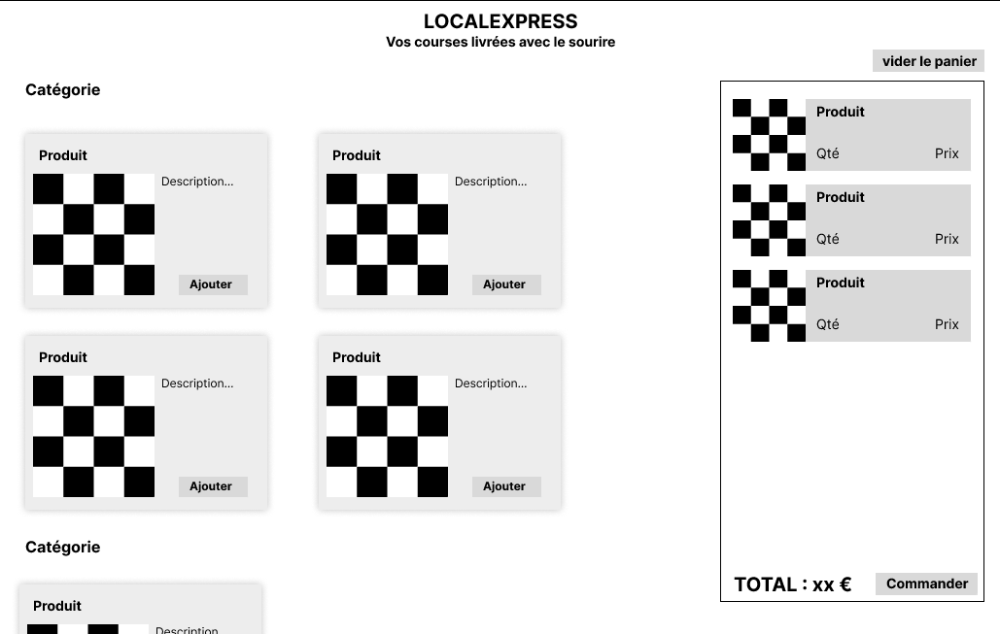

# Cahier des charges

**Société** LocalExpress

**Objectif** faire de la livraison de courses à domicile

## Description

Nous voulons une application web qui permet de commander des produits et
de se faire livrer à domicile. Nous ne vendons que quelques produits,
qui changent chaque semaine. Il n'est pas nécessaire d'avoir d'historique de commande.

Pour nous démarquer, nous souhaitons :

- Une interface simple, sans navigation. Les produits sont tous sur la même page, simplement rangés par catégories (a-z).
- Compatible smartphone
- Nous privilégions le contact humain
  - paiement à la livraison
  - facture papier (non gérée par l'application)
  - le livreur fera du _teasing_ sur les produits à venir

Nous n'avons pas de contrainte sur la technologie utilisée. Il nous faudra juste un back-office pour gérer les produits et voir les commandes.

## Interface

Voici une idée de l'interface que nous imaginons. Nous ne sommes pas designers,
donc n'hésitez pas à nous proposer des améliorations, car nous aimons vos réalisations.

Page d'accueil :

Page de sélection des produits :

Détail d'un produit :

Finalisation d'une commande :

Commande validée :

## Maquettes et zonage

TODO

## Conception

### User stories

TODO

### Cas d'utilisation

TODO

### Diagramme d'entité-association

TODO

### Diagramme de séquence

TODO

### Diagramme d'activité

TODO

### Diagramme de déploiement

TODO

### Schéma d'architecture

TODO
