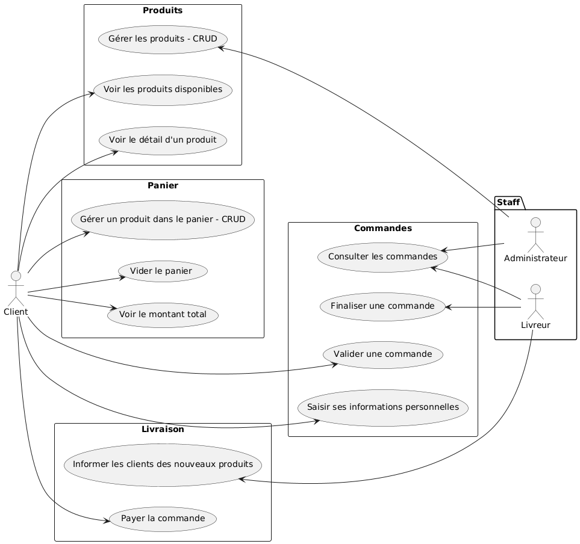

# LocalExpress – correction J01

→ Remplir au fur et à mesure le CDCF

## Maquette

> Maquette ou _zoning_ ?!?  
> → <https://becraft.fr/zoning-wireframe-prototype-comprendre-les-etapes-cles-de-la-conception-dinterface-utilisateur-ui/>

- **zoning** → `./assets/ui/zoning`
- **maquette** → `./assets/ui`

## _User stories_

[correction](./user-stories/LocalExpress_stories.md)

## _Use case_

> **NOTE** regarde dans ce dossier : il y a des alternatives…

→ extension VSCode ? [UMLet](https://marketplace.visualstudio.com/items?itemName=TheUMLetTeam.umlet)

## ERD

- Client / Commande
  - un **CLIENT** peut passer PLUSIEURS **COMMANDES**
  - une **COMMANDE** est passée par UN SEUL **CLIENT**

  → association _one-to-many_

- Commande / Ligne de commande
  - une **COMMANDE** contient UNE OU PLUSIEURS **LIGNES**
  - une **LIGNE** appartient à UNE SEULE **COMMANDE**

  → association _one-to-many_

- Ligne de commande / Produit
  - une **LIGNE** concerne UN SEUL **PRODUIT**
  - un **PRODUIT** peut apparaître dans PLUSIEURS **LIGNES**

  → association _one-to-many_

- Produit / Catégorie
  - un **PRODUIT** a UNE SEULE **CATÉGORIE**
  - une **CATÉGORIE** peut avoir PLUSIEURS **PRODUITS**

  → association _one-to-many_

> l'entité `Ligne de commande` est une table de liaison dûe à l'association
> `COMMANDE / PRODUIT` :
>
> - une commande peut contenir PLUSIEURS produits
> - un produit peut apparaître dans PLUSIEURS commandes
>
> → association _many-to-many_ → table de liaison `Ligne de commande`

## Diagrammes

### Séquence : mise au panier

### Activité : client

## Kanban

| Backlog          | Sprint                      | En cours              | Terminé                  |
| ---------------- | --------------------------- | --------------------- | ------------------------ |
| Back-office      | Workflow GitHub Actions     | Maquettes             | UML : Cas d'utilisation  |
| Tests end to end | UML : Déploiement           | Initialiser le projet | UML : Entité-association |
|                  | Page d'accueil              |                       | UML : Séquence           |
|                  | Page principale             |                       | UML : Activité           |
|                  | Modale détail d'un produit  |                       |                          |
|                  | Panier                      |                       |                          |
|                  | Finalisation de la commande |                       |                          |
|                  | Page de confirmation        |                       |                          |
|                  | Gestion des erreurs         |                       |                          |
|                  | Tests unitaires             |                       |                          |
