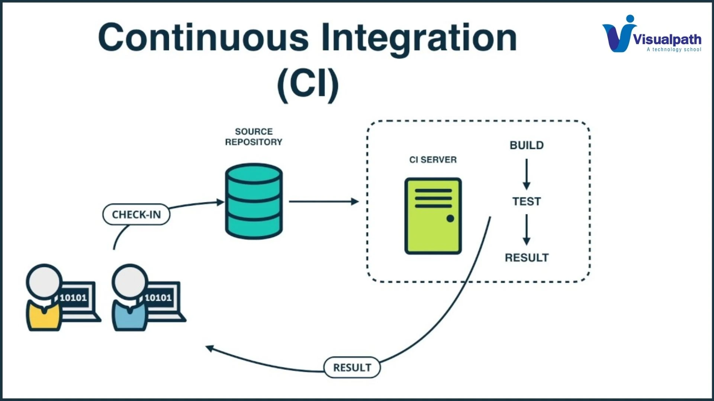

# CI

> _Continuous Integration_, intégration continue

Consiste à intégrer fréquemment le code des développeurs dans un dépôt
partagé avec des automatisations :

- **_Build_ automatique** : chaque modification de code déclenche
  une compilation, transpilation (ex. : React → JS).
- **Tests automatisés** : exécution de tests unitaires, d'intégration
  et fonctionnels pour détecter rapidement les erreurs.
- **Détection rapide des bugs** : les problèmes sont corrigés tôt,
  ce qui réduit les conflits entre les versions de code.

## Outils

- Système de _versioning_ : Git
- Plateforme d'hébergement de code : GitHub
  - _versioning_
  - CI
- Tests unitaires : Jest, Mocha, Travis CI
- Analyse de code : ESLint, Biome, SonarQube
- Couverture de tests : Codecov
