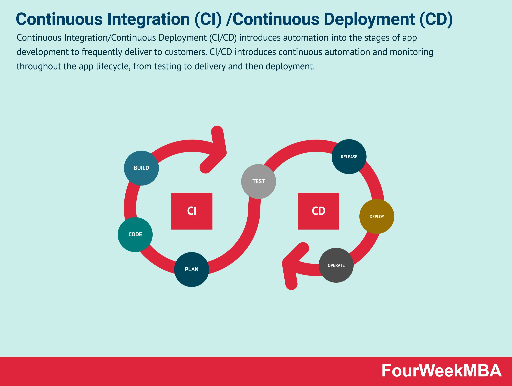
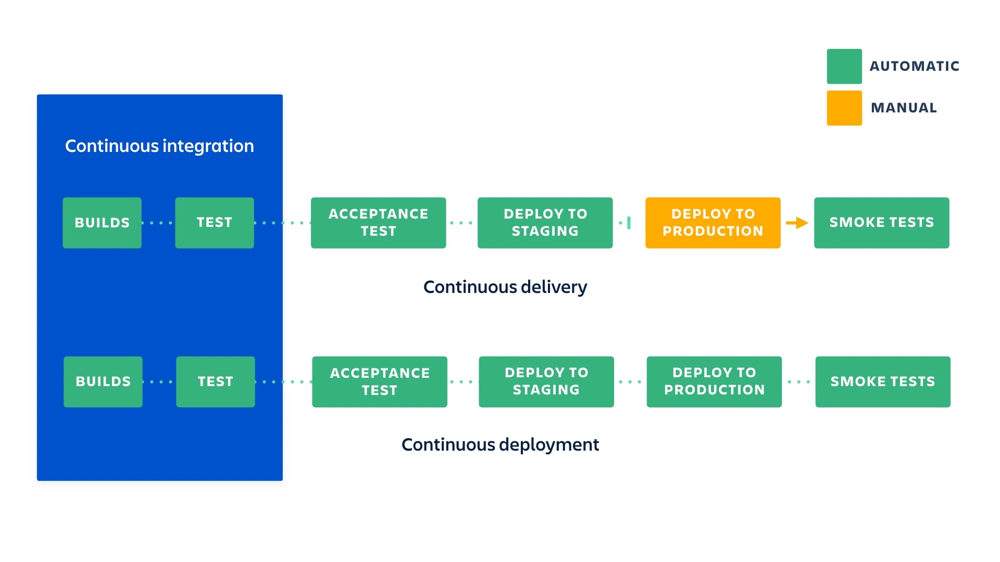

# CD

> _Continuous Delivery_, Livraison continue  
> _Continuous Deployment_, Déploiement continu

Suite logique du CI.

2 approches :

1. **Livraison continue** : le code validé est **automatiquement préparé**
   (_build_) pour un **déploiement manuel** de l'application

2. **Déploiement continu** : chaque mise à jour validée est automatiquement
   **déployée** en production, **sans intervention humaine**

